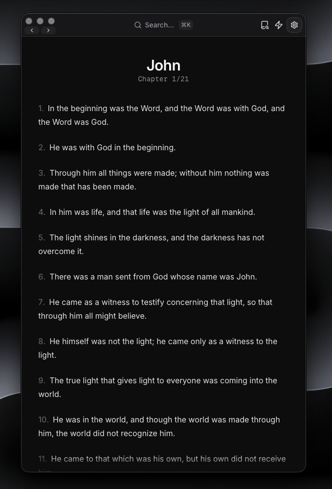
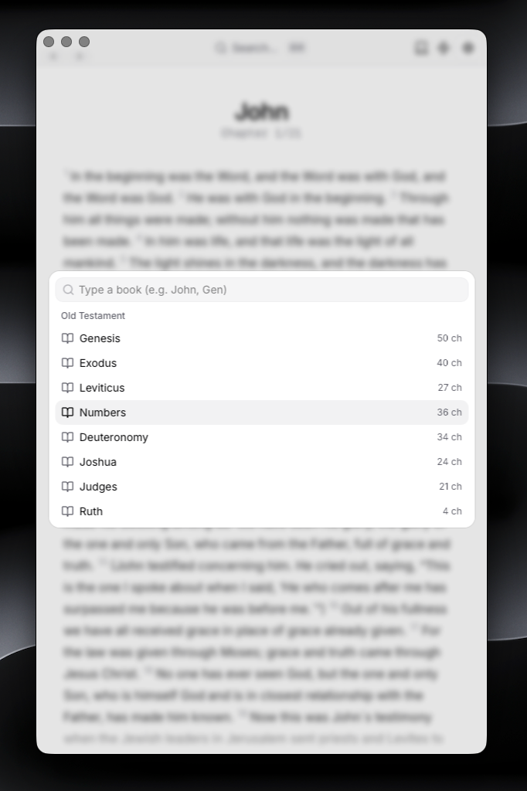
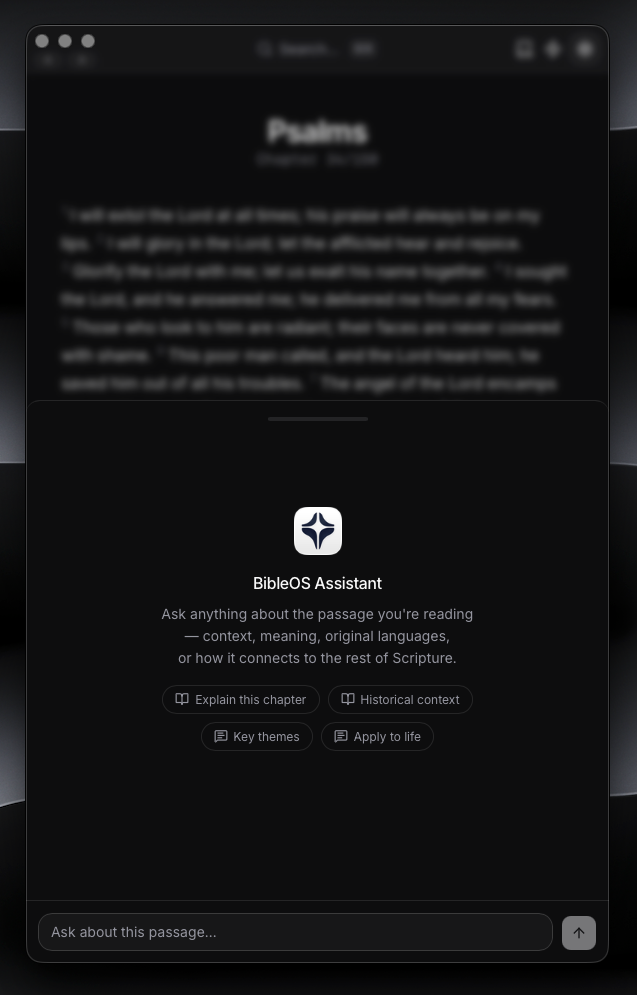
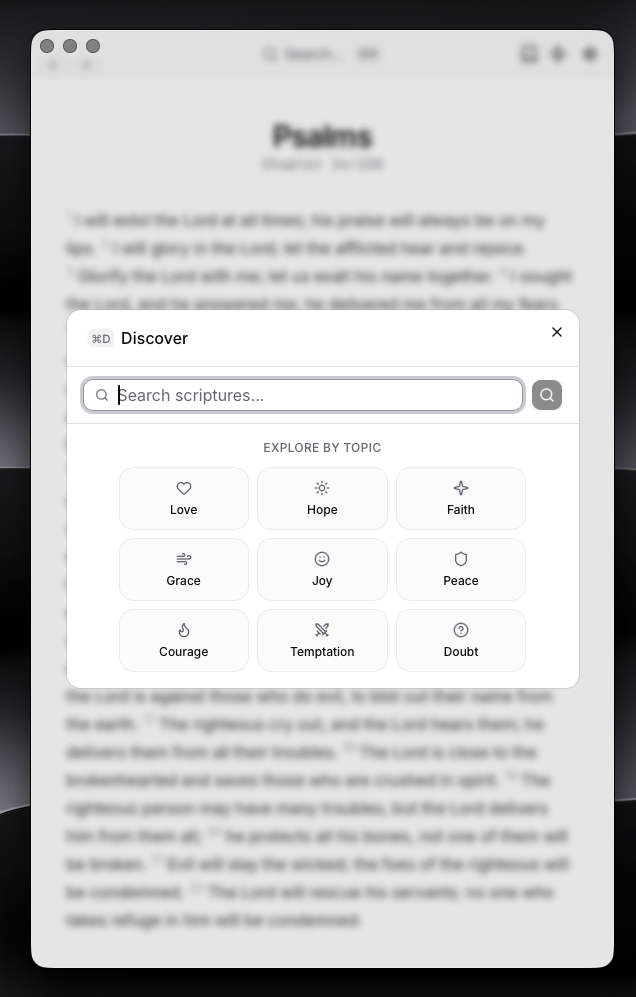

<div align="center">
  
  <h1>Bible OS</h1>
  <p><strong>A beautiful, lightweight Bible reader app with integrated AI chat</strong></p>
  <p>
    <a href="#features">Features</a> •
    <a href="#planned-features">Planned</a> •
    <a href="#installation">Installation</a> •
    <a href="#development">Development</a> •
    <a href="#tech-stack">Tech Stack</a>
  </p>
</div>

---

## Overview

**Bible OS** is an open-source Bible reader application designed for Bible study and spiritual growth. Built with modern technologies (Rust, Tauri, React, Shadcn), it delivers a tiny (~10-20MB), fast, and beautifully designed desktop experience.

The app combines a Bible reader with AI-powered capabilities for discussing scripture, generating spiritual content, and discovering deeper context—all offline-first and privacy-conscious.

## Features

- [x] Bible Reader - Clean, fast interface for reading through Bible books and chapters
- [x] Fast Search - Quickly find books, chapters, and verses across the entire Bible
- [x] AI Chat Integration - Discuss scripture context, ask questions, and explore deeper meanings
- [x] Dark/Light Mode - Comfortable reading experience in any lighting condition
- [x] Lightweight - Built with Tauri, minimal footprint without sacrificing functionality
- [x] Privacy-First - Local. Your data stays on your machine, AI is BYOK
- [x] Discover - Explore related content, commentaries, and insights based on your reading

## Planned Features

- [ ] Verse Highlighting and Annotations - Save and organize your favorite verses and notes
- [ ] Note-Taking System - Create personal study notes tied to specific passages
- [ ] Mobile Devices Support - iOS and Android apps via Tauri Mobile
- [ ] Bible Versions Support - KJV, NIV, ESV, and more translations
- [ ] Advanced Study Tools - Commentaries, cross-references, word studies
- [ ] Export Capabilities - Export notes, highlights, and passages to PDF/Markdown
- [ ] Advanced AI features - more models, RAG, memory, etc.

## App Demo (macOS)

<div align="center">
  <table>
    <tr>
      <td></td>
      <td></td>
    </tr>
    <tr>
      <td align="center"><em>Main Reader Interface</em></td>
      <td align="center"><em>Book & Search Navigation</em></td>
    </tr>
  </table>
  
  <table>
    <tr>
      <td></td>
      <td></td>
    </tr>
    <tr>
      <td align="center"><em>AI Chat Assistant</em></td>
      <td align="center"><em>Discovery Features</em></td>
    </tr>
  </table>
</div>

## Tech Stack

### Frontend

- **[React](https://react.dev)** v19 - Modern UI framework
- **[Vite](https://vitejs.dev)** - Lightning-fast build tool
- **[TypeScript](https://www.typescriptlang.org)** - Type-safe development
- **[Tailwind CSS](https://tailwindcss.com)** v4 - Utility-first styling
- **[shadcn/ui](https://ui.shadcn.com)** - High-quality React components
- **[Zustand](https://github.com/pmndrs/zustand)** - Lightweight state management
- **[React Router](https://reactrouter.com)** - Client-side routing

### Backend & Desktop

- **[Tauri](https://tauri.app)** v2.0 - Cross-platform desktop framework
- **[Rust](https://www.rust-lang.org)** - High-performance systems language
- **[SQLite](https://www.sqlite.org)** - Efficient data storage

### AI Features

- **[Vercel AI SDK](https://sdk.vercel.ai)** - Unified AI integration (Open to switching to custom SDK)
- **[OpenAI](https://openai.com)** - Language model capabilities

### Additional Libraries

- **[clsx](https://github.com/lukeed/clsx)** - Utility for classname management
- **radix-ui** - Headless UI components
- **cmdk** - Command menu component

## Installation

### Prerequisites

- **Node.js** v18+ and **pnpm**
- **Rust** (for building Tauri backend)
- **Xcode Command Line Tools** (macOS)

### Quick Start

1. **Clone the repository**

   ```bash
   git clone https://github.com/crynta/BibleOS.git
   cd BibleOS
   ```

2. **Install dependencies**

   ```bash
   pnpm install
   ```

3. **Start development server**
   ```bash
   pnpm tauri dev
   ```

The app will launch and you can start using it immediately!

### Building for Distribution

Build a production-optimized binary:

```bash
pnpm build
pnpm tauri build
```

**Build the Bible database from sources (JSON)**

```bash
   pnpm db:build
```

This creates a distributable binary in `src-tauri/target/release/`.

## Development

### Project Structure

```
bible-os/
├── src/                  # React frontend
│   ├── components/       # React components
│   ├── lib/             # Utilities, API, hooks, types
│   ├── stores/          # Zustand state stores
│   └── App.tsx          # Main app component
├── src-tauri/           # Tauri backend (Rust)
│   ├── src/             # Rust source code
│   ├── Cargo.toml       # Rust dependencies
│   └── resources/       # Bible data (SQLITE/JSON)
├── scripts/							# Build and utility scripts
└── demo/                # Demo screenshots
```

### Available Commands

```bash
# Start development server
pnpm dev

# Type check
pnpm tauri dev

# Build frontend
pnpm build

# Build desktop app
pnpm tauri build

# Preview production build
pnpm preview

# Rebuild Bible database from sources
pnpm db:build
```

### Setting Up AI Chat

To enable AI features, you'll need an API key:

1. Get an OpenAI API key from [platform.openai.com](https://platform.openai.com)
2. Set your API key in the app settings
3. Start chatting with the AI assistant about scripture

## Configuration

The app uses the following Tauri plugins configured in `src-tauri/tauri.conf.json`:

- **sql**: SQLite database operations
- **fs**: File system access
- **window-state**: Remember window position/size
- **store**: Persistent app configuration storage
- **opener**: Open external links

## Scripture Data Format

Bible data is stored as JSON files in `src-tauri/resources/books/`:

```json
{
  "book": "Genesis",
  "chapters": [
    {
      "chapter": 1,
      "verses": [
        {
          "verse": 1,
          "text": "In the beginning God created the heavens and the earth."
        }
      ]
    }
  ]
}
```

## Contributing

This is a personal project with open-source code. Contributions are welcome! Feel free to:

- Report bugs
- Suggest features
- Submit pull requests
- Improve documentation

## License

This project is licensed under the MIT License. See the [LICENSE](LICENSE) file for details.

```
MIT License

Copyright (c) 2026

Permission is hereby granted, free of charge, to any person obtaining a copy
of this software and associated documentation files (the "Software"), to deal
in the Software without restriction, including without limitation the rights
to use, copy, modify, merge, publish, distribute, sublicense, and/or sell
copies of the Software, and to permit persons to whom the Software is
furnished to do so, subject to the following conditions:

The above copyright notice and this permission notice shall be included in all
copies or substantial portions of the Software.
```

<div align="center">
  <p>Made for Bible study and spiritual growth</p>
</div>
